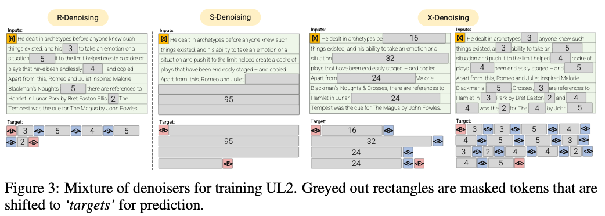

# Masking implementation for Unifying Language Learning Paradigms (UL2) - WIP

  

- R-Denoiser (μ=3,r=0.15,n)∪ (μ=8,r=0.15,n)

    The regular denoising is the standard span corruption introduced in Raffel et al. (2019) that uses a range of 2 to 5 tokens as the span length, which masks about 15% of input tokens

- S-Denoiser (μ=L/4,r=0.25,1)

    A specific case of denoising where we observe a strict sequential order when framing the inputs-to-targets task, i.e., prefix language modeling

- X-Denoiser (μ = 3,r = 0.5,n)∪(μ = 8,r = 0.5,n)∪(μ = 64,r =0.15,n)∪ (μ=64,r=0.5,n)

    An extreme version of denoising where the model must recover a large part of the input, given a small to moderate part of it. This simulates a situation where a model needs to generate long target from a memory with relatively limited information. To do so, we opt to include examples with aggressive denoising where approximately 50% of the input sequence is masked
